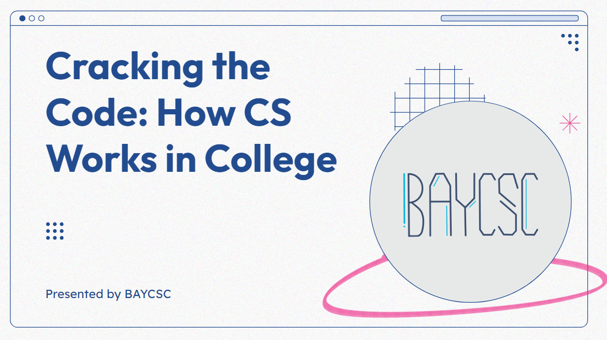

# README.md

## About

[BAYCSC](https://baycsc.org/) is a high school group that advocates for
computer science education. This repo contains the slide deck and script used for the presentation in [CS in College panel](https://docs.google.com/presentation/d/1U4kzueTMoljIdmTyBaBHsDmWEnRqIuwSjv_1m6WLDXU/edit?exids=71471476,71471470#slide=id.p).

I used the [obsidian slide tool](https://github.com/MSzturc/obsidian-advanced-slides) to build and export this presentation.

---
- [Live Presentation Link](https://totally-not-frito-lays.github.io/BAYCSC-Presentation/#/)
- [LinkedIn](https://www.linkedin.com/in/rlay/)
